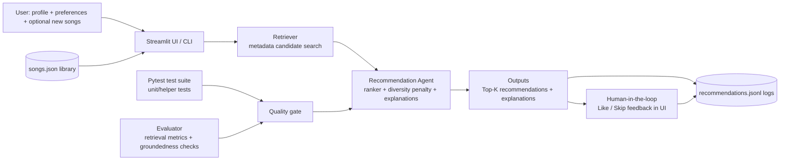

# System Architecture

## Flow Summary

1. Input: user preferences and song library enter via UI or CLI.
2. Process: retriever narrows candidates, then recommendation logic ranks and explains results.
3. Output: recommendations are shown and logged.
4. Human check: users rate recommendations (like/skip), and feedback is logged.
5. Automated checks: evaluator and tests verify retrieval quality, groundedness, and helper logic.
