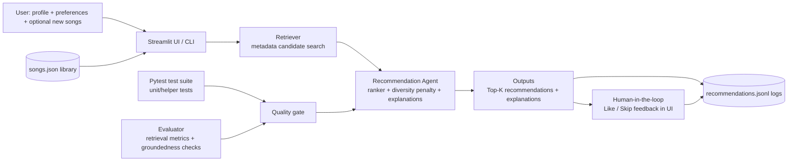

# Playlist Chaos: AI-assisted music recommender and playlist organizer

## Original project from Modules 1-3
My original project from Modules 1-3 was Music Recommender Simulation. It was a rule-based song ranking engine that scored tracks by genre, mood, and energy, then returned top matches with short explanations. The main goal was to learn how recommendation logic works under the hood without hiding behavior behind a black box model.

## Title and summary
Playlist Chaos extends that original recommender into a full interactive system with both CLI and Streamlit interfaces. Users can browse and organize playlists, add songs, request recommendations, and give like or skip feedback that gets logged for analysis.

Why this matters: I wanted a portfolio project that shows practical AI system thinking, not just a model notebook. The project demonstrates retrieval + ranking, explainability, human feedback capture, and test coverage in one small but complete application.

## Architecture overview
The system diagram below maps a straightforward pipeline:



1. User preferences and the song library enter through the Streamlit UI or CLI.
2. A retriever narrows the catalog to likely candidates using metadata signals.
3. The ranking layer scores candidates, applies a diversity penalty, and generates explanation text.
4. Outputs are shown to the user and logged to recommendations.jsonl.
5. The user can submit like or skip feedback, which is also logged.
6. Pytest and the evaluation harness act as quality gates for helper logic, retrieval quality, and grounded explanations.

In short, this is a small end-to-end AI product loop: input, retrieval, ranking, explanation, user feedback, and evaluation.

## Agentic workflow enhancement
The recommendation flow now supports explicit multi-step reasoning with observable intermediate steps.

What is implemented:
1. Plan step: builds a recommendation plan from user preferences and run settings.
2. Retrieve step: executes candidate retrieval and records source counts plus top retrieved items.
3. Rank step: scores and re-orders candidates with diversity-aware ranking.
4. Decide step: finalizes top-k output and records decision summary.

Where you can observe the chain:
1. CLI (`python -m src.main`): prints the decision trace before recommendations.
2. Streamlit (`streamlit run src/streamlit_app.py`): enable "Show Agentic Reasoning Trace" to inspect structured trace JSON.
3. Logs (`recommendations.jsonl`): each recommendation event now stores `decision_trace` for auditing.

## Setup instructions
1. Clone the repository and move into the project folder.
2. Create a virtual environment.

```bash
python -m venv .venv
```

3. Activate the virtual environment.

Windows (PowerShell or Git Bash):

```bash
.venv/Scripts/activate
```

macOS/Linux:

```bash
source .venv/bin/activate
```

4. Install dependencies.

```bash
pip install -r requirements.txt
```

5. Run the CLI demo.

```bash
python -m src.main
```

6. Run the Streamlit app.

```bash
streamlit run src/streamlit_app.py
```

7. Run tests.

```bash
pytest -q
```

8. Run evaluation metrics.

```bash
python src/evaluation.py
```

## Sample interactions
These examples were generated from the current codebase and dataset.

### Example 1: party pop profile
Input:

```python
{
    "genre": "pop",
    "mood": "euphoric",
    "energy": 0.78,
    "preferred_mood_tags": ["party", "bold"],
    "scoring_mode": "genre-first"
}
```

Output (top 3):

```text
1. Blinding Lights | score=8.19
2. Levitating      | score=7.33
3. Greedy          | score=6.29
```

Sample explanation text:

```text
genre match (+3.0); mood match (+0.8); energy closeness (+2.45);
non-acoustic preference match (+0.4); popularity boost (+0.94);
mood-tag overlap x1 (+0.60)
```

### Example 2: chill study profile
Input:

```python
{
    "genre": "lofi",
    "mood": "peaceful",
    "energy": 0.30,
    "likes_acoustic": True,
    "preferred_mood_tags": ["study", "relax"],
    "scoring_mode": "mood-first"
}
```

Output (top 3):

```text
1. Lo-fi Rain | score=10.57
2. Weightless | score=7.90
3. Sincerity  | score=6.28
```

### Example 3: intense workout profile
Input:

```python
{
    "genre": "rap",
    "mood": "intense",
    "energy": 0.90,
    "preferred_mood_tags": ["adrenaline"],
    "scoring_mode": "energy-focused"
}
```

Output (top 3):

```text
1. Evil Jordan   | score=8.65
2. Thunderstruck | score=8.26
3. Sandstorm     | score=7.09
```

## Design decisions and trade-offs
1. Retrieval plus ranking instead of one big score pass.
Reason: easier to inspect why songs were considered at all, then why they were ranked high.
Trade-off: more moving parts than a single pass scorer.

2. Rule-based scoring with explicit weights.
Reason: behavior is transparent and easy to tune during class experiments.
Trade-off: less adaptive than learned models and sensitive to manual weight choices.

3. Diversity penalty in ranking.
Reason: avoids repetitive top results from the same artist or genre.
Trade-off: sometimes pushes down a technically better match for variety.

4. Streamlit session state for playlist edits and history.
Reason: gives immediate, interactive behavior without backend infrastructure.
Trade-off: state is local to a session and not multi-user persistent.

5. JSONL logging for recommendations and feedback.
Reason: simple audit trail and easy to parse for analysis.
Trade-off: no dashboard yet; analysis is manual or script-based.

## Testing summary
Current status:

```text
15 passed in 0.72s
```

Reliability summary:

```text
15/15 automated tests passed.
Benchmark evaluation reached 100% recall on 5 queries and 100% groundedness.
Average precision was lower on mixed queries, so validation, normalization, and diversity rules were kept in place to reduce weak matches.
```

What worked:
1. Unit tests for scoring behavior, scoring modes, diversity penalties, and explanation generation.
2. Streamlit helper tests for playlist classification, search, stat computation, normalization, and row formatting.
3. Evaluation harness reports 100% recall for expected genres and moods across benchmark queries in the current setup.
4. Groundedness check reports 100% for sampled recommendations, meaning explanations reference known metadata fields.

What did not work as well:
1. Precision is much lower than recall in evaluation, so some retrieved songs are related but not the tightest match.
2. The catalog is still relatively small and biased toward certain genres and moods.
3. Mood matching is still mostly categorical and can miss nuanced in-between moods.

What I learned from testing:
1. High recall is easy to achieve with broad retrieval rules.
2. Precision and diversity need constant balancing.
3. Good tests for helper functions prevent UI logic regressions when features expand.

## Reflection
This project taught me that AI problem-solving is mostly systems thinking: how data, heuristics, user interaction, and evaluation connect. The recommendation quality did not improve by changing one formula alone; it improved when I tightened the full loop of retrieval, ranking, explanation, and feedback logging.

I also learned to treat transparency as a feature, not an afterthought. Writing explanation strings, logging recommendation events, and running benchmark checks made it easier to spot weak points and adjust quickly. If I continue this project, my next step is expanding the catalog and using logged feedback to adapt weights over time.
